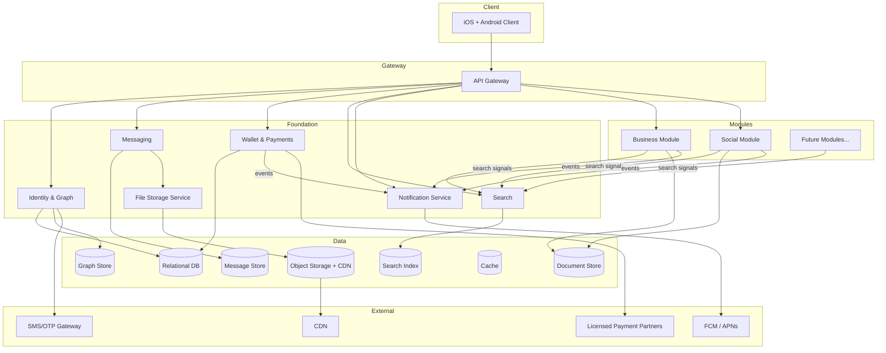

# Architecture

## Architecture Overview

**Platform:** `Mobile (iOS + Android)` — copied from [[branding]] Section 1. Pamoja is phone-first; a web/desktop companion is a later surface, not part of this architecture's primary client.
**Architecture Style:** Modular Service-Oriented — one service per bounded context, with a shared Foundation platform underneath. Each opt-in module (Business, Social, future additions) is an independently deployable service; none depends on another module's service.
**Primary Client:** Mobile App (iOS + Android)
**Hosting Model:** Cloud (multi-region-ready, Africa-first — primary region in/near the launch market, with region-per-market as the platform expands)

Pamoja is built as five layers that mirror the WeChat stack: the **Identity & Graph** foundation is the moat, **Messaging** is the connective tissue, the **Wallet & Payments** service abstracts licensed partner rails, the **Search** service is the discovery layer over all channels, and **module services** (Business, Social, future) sit on top — each independent, each declaring its own search signals. The design goal is that a new module is *appended*: add a service, register its search signals, and it joins the platform without reworking anything below it.

## System Components

### Component: Mobile Client (iOS + Android)

**Responsibility:** Delivers the entire Pamoja experience — chats, channels, wallet, search, and module surfaces — with offline-first behavior.
**Provides:** Screen rendering, channel management, chat, in-app payments, data-light mode, local caching, offline write queueing.
**Consumes:** API Gateway (data), Messaging Service (real-time), Notification Service (push), File Storage (uploads).
**Platform Notes:**
- **Offline is a first-class requirement**, not an afterthought: chats and orders queue locally and replay on reconnect; the UI reflects "queued/delivered/read" states.
- **Data-light mode** is client-resident: image compression, deferred media, no autoplay, cached channel/catalog content — driven by user preference, per [[features]] FEAT-030.
- App lock (PIN/biometric) is client-side with server re-verification for wallet actions, per FEAT-028.
- Both platforms must support push (FCM + APNs), background sync, and low-bandwidth degradation.

### Component: API Gateway

**Responsibility:** Single entry point for all client traffic; routes to foundation and module services, enforces authentication, rate limiting, and request validation.
**Provides:** REST endpoints per service, auth enforcement, request/response shaping for mobile payloads.
**Consumes:** Auth within Identity & Graph, all foundation and module services.
**Platform Notes:** Mobile-optimized payloads (no redundant data), compression for low-bandwidth, and a stable contract that the web companion can reuse later.

### Component: Identity & Graph Service

**Responsibility:** Owns who a user is and who they're connected to — registration, OTP, channel profiles, the contact graph, verification, and the permission model for who can see what.
**Provides:** User accounts, channel profile (name/bio/avatar — Layer 0 findability), mutual connections, merchant verification status, block/report records.
**Consumes:** SMS/OTP gateway, KYC data from the payment partner where applicable.
**Platform Notes:** The graph is the moat — it must stay relationship-based (mutual connections), never follower-based. Privacy boundaries are enforced here: a merchant sees the same channel identity a customer shares with everyone (no hidden buyer data), per FEAT-025.

### Component: Messaging Service

**Responsibility:** Real-time and queued delivery of 1:1 and group messages — text, images, voice notes, files — with delivery/read states.
**Provides:** Chat threads, message history, delivery/read acknowledgements, voice-note upload handling, group membership.
**Consumes:** Identity & Graph (participants), File Storage (media), Notification Service (push for missed messages).
**Platform Notes:** Push-based real-time delivery with offline queueing on the client; media referenced by ID and fetched via CDN/object storage; hold-to-talk voice notes are first-class (upload while recording, lightweight delivery).

### Component: Wallet & Payments Service

**Responsibility:** Owns all money movement — the wallet abstraction over licensed partner rails, P2P transfers, QR payments, order payments, transaction history, and multi-currency balances.
**Provides:** Wallet balances, transfers, QR pay, transaction ledger, receipts, currency conversion, settlement status.
**Consumes:** Identity & Graph (counterparty identity), licensed payment partners (per market), Notification Service (payment confirmations).
**Platform Notes:** **This is a rail abstraction, not a bank.** No card/bank credentials are stored in Pamoja — all sensitive payment data and CBN compliance live with the licensed partner, per [[README]] and FEAT-010. Idempotency is mandatory (a retried request must never double-debit). KYC/AML is delegated to the partner.

### Component: Search Service

**Responsibility:** The unified, intent-driven index over the whole network — the product's discovery layer.
**Provides:** Grouped search results (channels, people, messages), intent understanding (commerce vs. social vs. identity queries), relevance ranking, filters.
**Consumes:** Identity & Graph (Layer 0 name/bio signals), module services (their declared search signals), Messaging (message search).
**Platform Notes:** The index is **extensible by design**: each module registers what of its data is searchable (per the findability model in [[README]]). "I want to buy shoes" is classified as commerce intent and ranks business channels; "afrobeats" is social intent and ranks social channels by name/bio. A new module's search integration is a registration, not a rebuild.

### Component: Business Module Service

**Responsibility:** The complete merchant toolkit — catalog, orders, inventory, delivery stages, analytics. An opt-in module; independent of all other modules.
**Provides:** Product catalog, order inbox with status workflow, in-chat checkout orchestration, inventory, delivery tracking, merchant analytics, business tags/location.
**Consumes:** Identity & Graph (merchant + buyer identities), Wallet & Payments (order payments), Messaging (order/checkout messages), Search (declares catalog/tag signals), Notification Service.
**Platform Notes:** Orders and payments are linked by order ID; a payment failure leaves the order pending with a retry, per FEAT-018. No CRM separation — buyers are graph contacts, and the service reads buyer identity from the graph, never a segmented customer list.

### Component: Social Module Service

**Responsibility:** The private friends feed, status, and self-expression — the social module. Independent of the Business Module.
**Provides:** Moments-style posts, comments (mutual-connections visibility), status, sticker delivery.
**Consumes:** Identity & Graph (connections and mutual-friend visibility), File Storage (post media), Search (declares social signals), Notification Service.
**Platform Notes:** Visibility rules are strict and graph-derived: posts visible only to connections; comments visible only to mutual connections — enforced server-side, never client-side.

### Component: Notification Service

**Responsibility:** Delivers push, in-app, and transactional notifications for messages, orders, payments, and delivery updates.
**Provides:** Cross-platform push (FCM + APNs), in-app notification center, per-category user preferences, no-spam policy.
**Consumes:** Foundation and module services (event subscriptions), push providers.
**Platform Notes:** Per-category opt-in (messages, orders, payments, promotions) and no promotional pushes without explicit consent, per FEAT-032.

### Component: File Storage Service

**Responsibility:** Stores and serves all user-generated media — profile images, chat images, voice notes, product photos, post media — with compression for data-light mode.
**Provides:** Upload, CDN delivery, compression variants (standard + data-light), access-scoped URLs.
**Consumes:** Object storage/CDN.
**Platform Notes:** Media is stored once and served through CDN; data-light variants are generated at upload time, not on demand.

### Component: Analytics & Events Service

**Responsibility:** Captures product events and powers merchant analytics and platform reporting.
**Provides:** Event stream, merchant analytics (sales, orders, top products — FEAT-022), platform health and growth metrics.
**Consumes:** Foundation and module services (event subscriptions).
**Platform Notes:** Merchant analytics must reflect real order data (never mock), and be shareable as a summary for credit applications.

## Data Architecture

### Data Stores
| Store | Type | What It Holds | Access Pattern |
|---|---|---|---|
| Primary Database | Relational | User accounts, channel profiles, wallets, orders, transactions, verification records | Read-heavy with transactional writes (money movement) |
| Graph Store | Graph | The contact network — connections, mutual relationships, channel-to-channel visibility | Graph traversals (who can see what, feed visibility) |
| Message Store | Document / log | Chat threads, messages, delivery states, voice-note metadata | Append-heavy, read-mostly, paginated |
| Document Store | Document | Product catalogs, social posts, comments, module content | Read-heavy, per-owner writes |
| Search Index | Full-text + intent | Indexed signals from channels and modules | Read-only queries; updated via events |
| Cache | In-memory | Sessions, hot channel profiles, rate-limit counters, wallet balances in view | Fast reads, TTL-based |
| File Storage | Object store + CDN | Images, voice notes, files, compression variants | Write-once, read-many |

### Data Flow Patterns
- **Synchronous:** CRUD through API Gateway → service → store (profile edits, catalog changes, wallet checks).
- **Asynchronous:** Domain events on change — order placed → notify buyer/merchant, update search index, feed merchant analytics. Modules publish their search-signal events to the Search Service on change.
- **Offline:** Mobile client keeps a local cache; writes queue while offline and replay on reconnect with idempotency keys (critical for payments — a replayed transfer must not double-debit). Delivery/read states reconcile after reconnect.

## External Integrations

| Service | Purpose | Direction | Criticality |
|---|---|---|---|
| Licensed payment partners (per market: Paystack, Flutterwave, OPay, M-Pesa, Wave, etc.) | Wallet funding, transfers, QR, settlements, KYC/AML, multi-currency corridors | Outbound (API) + partner callbacks/webhooks | High |
| SMS/OTP gateway | Registration and verification codes | Outbound (API) | High |
| Push providers (FCM, APNs) | Push notifications to mobile devices | Outbound (API) | Medium |
| Object storage / CDN | User media hosting and delivery | Outbound (API) | Medium |
| Analytics platform | Product event tracking | Outbound (event stream) | Low |

## Deployment Topology

### Environments
| Environment | Purpose | Data |
|---|---|---|
| Development | Active development and integration testing | Synthetic data, freely reset |
| Staging | Pre-release validation, stakeholder review | Anonymized production-like data |
| Production | Live user traffic | Real data, backups, retention policies |

### Regions
**Primary region:** in/near the launch market (Nigeria) to minimize latency for the first users.
**Expansion regions:** region-per-market as the platform opens new countries — each market's data locality follows that market's regulations (per-jurisdiction, since NDPR does not extend beyond Nigeria, per [[README]]). Cross-border wallet flows span regions only for the corridor currencies that justify it.

### Scaling Strategy
Horizontal scaling for stateless services (API Gateway, Search, Notifications) behind the gateway. The graph and message stores scale per region. Autoscaling on load; the Search index scales as the network and module count grow.

## Cross-Cutting Concerns

**Authentication & Authorization:** Phone + OTP registration; session tokens; app lock (PIN/biometric) client-side; wallet actions re-verify. Authorization is graph-derived: what a user can see follows connection and module visibility rules, enforced server-side. Merchant verification and block/report records live in Identity & Graph and gate trust features.
**Error Handling:** Transfers are atomic and idempotent; failed payments leave orders pending with explicit retry. Offline writes queue and replay; the client always shows queued vs. delivered state so users never lose an order or message silently.
**Logging & Monitoring:** Service-level logs, payment settlement trails (for partner reconciliation), search query metrics, and fraud/abuse signals. Merchant and platform dashboards read from Analytics & Events.
**Backup & Recovery:** Continuous backups of transactional stores; retention policies per data class; the graph and wallet stores have recovery drills — the wallet is the one store whose loss is existential.

## Architecture Diagram

