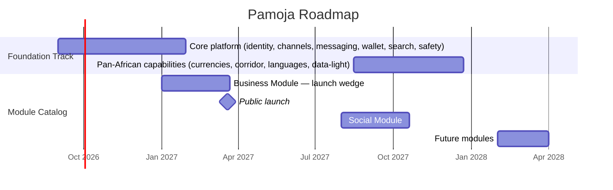

# Roadmap

## Vision Statement

Pamoja is the one place where Africans talk, pay, and sell. Every person has a channel; every channel can be found; and any user can buy from, sell to, or connect with someone else across the continent — in one trusted network of real people.

## Timeline Overview

## Phase 1: Platform Foundation — Core

**Goal:** Build the substrate every module rides on — a trusted network where people can identify themselves, connect with the people they know, message, move money, and find things.
**Target:** Sept 2026 – March 2027.

**Key Outcomes:**
- Anyone can join with a phone number, build a channel, and connect with real people
- Messaging and payments work reliably on low-bandwidth connections
- One search box finds channels, people, and messages across the network
- Money movement is partner-backed, safe, and locked down from day one

**Features Delivered:**

| Feature ID | Feature | Why It Matters |
|---|---|---|
| FEAT-001 | Phone registration & OTP | Joining must take seconds, not paperwork |
| FEAT-002 | Channel profile creation | Every user's public face and findability starts here |
| FEAT-003 | Contact graph | The real-person network — Pamoja's moat |
| FEAT-004 | Channel modules opt-in | The mechanism every future module plugs into |
| FEAT-006 | 1:1 messaging | The connective tissue of the whole loop |
| FEAT-010 | Wallet & P2P transfers | Paying a friend is as easy as messaging them |
| FEAT-011 | QR payments | Money moves in the physical market, not just online |
| FEAT-012 | Transaction history & receipts | Proof of every naira — for buyers and sellers |
| FEAT-023 | Unified search | One search box for channels, people, and messages |
| FEAT-025 | Channel visibility | Customers are friends, not rows in a CRM |
| FEAT-028 | App lock | Money and chats stay safe on a lost phone |
| FEAT-029 | Block, report & scam response | The network is safe from the first real transaction |

## Phase 2: Business Module — Launch Wedge

**Goal:** Ship the merchant toolkit and prove the core promise — a trader can pull her customers into Pamoja, and they can discover, order, pay, and track a purchase without leaving the app. **Public launch happens at the end of this phase.**
**Target:** Jan – March 2027; pilot in Lagos and the major markets (Onitsha, Aba, Balogun, Computer Village).

**Key Outcomes:**
- Merchants list products, receive orders, and get paid inside the same conversation as their customers
- Search finds shops by name, bio, tags, and catalog — "I want to buy shoes" finds the right seller
- Verified merchants earn trust with a gold badge
- Inventory, delivery, and analytics complete the toolkit so a trader can run her whole business on Pamoja

**Features Delivered:**

| Feature ID | Feature | Why It Matters |
|---|---|---|
| FEAT-016 | Product catalog | Merchants finally have a real storefront |
| FEAT-017 | Order inbox | No sale ever lost in chat history again |
| FEAT-018 | In-chat checkout | Order, pay, and receipt in one conversation |
| FEAT-019 | Business tags & searchable catalog | "I want to buy shoes" finds the right shop |
| FEAT-005 | Merchant verification badge | Trust at scale — proof a business is real |
| FEAT-024 | Business content search | Find the product, not just the shop |
| FEAT-020 | Inventory management | No more overselling what's not in the shop |
| FEAT-021 | Delivery tracking | Both sides know where the goods are |
| FEAT-032 | Push notifications | No one misses a message, an order, or a payment |
| FEAT-022 | Merchant analytics | Sales numbers a trader can act on or show a lender |

## Phase 3: Social Module — Community Layer

**Goal:** Turn Pamoja from a commerce tool into a place people *live* — the private feed and community features that bring users back daily, now that the graph has density to make them meaningful.
**Target:** Aug – Oct 2027.

**Key Outcomes:**
- The private friends feed makes channels feel alive between purchases
- Groups, calls, and bill-splitting let communities and buyer circles coordinate in one thread
- Chat feels like home, not a ledger

**Features Delivered:**

| Feature ID | Feature | Why It Matters |
|---|---|---|
| FEAT-026 | Private friends feed | The social module's core — why people return daily |
| FEAT-007 | Group messaging | Families, markets, and buyer groups in one thread |
| FEAT-013 | Split bills & payment requests | Settling shared costs is quick and social |
| FEAT-008 | Voice & video calls | Talk face to face without another app |
| FEAT-027 | Status & light self-expression | Channels feel alive between purchases |
| FEAT-009 | Stickers & emoji | Chat feels like home, not a ledger |

## Phase 4: Foundation — Pan-African Capabilities

**Goal:** Deliver the Africa-first promise: the platform itself learns to work across currencies, borders, and languages — so the next module and the next market both have what they need.
**Target:** Aug 2027 – Feb 2028.

**Key Outcomes:**
- The wallet holds multiple currencies and converts transparently
- The first cross-border corridor makes sending money home dramatically cheaper
- The app speaks the user's language as new markets open
- Daily use stays affordable on pay-per-MB data plans

**Features Delivered:**

| Feature ID | Feature | Why It Matters |
|---|---|---|
| FEAT-014 | Multi-currency wallet | The Africa-first promise starts paying off |
| FEAT-015 | Cross-border transfers | The corridor that proves "Africa-first" |
| FEAT-031 | Multi-language UI | English is not the only market |
| FEAT-030 | Data-light mode | Daily use stays affordable on limited data |

## Module Catalog — Future Modules

Candidates for the module catalog. None have feature IDs yet — they enter the roadmap only when [[features]] adds them and a planning cycle prioritizes them.

| Module | What it would add | Search signals it declares |
|---|---|---|
| **Creator Module** | Content and audience tools for creators and influencers | Post topics, content categories |
| **Services Module** | Local services — artisans, repairs, lessons, bookings | Location, pricing, service types |
| **Mini-App Platform** | Third-party mini-apps (the WeChat Mini Program equivalent) | Per mini-app, declared by the provider |
| **Government & City Services** | Public services integration per market | Per service, per jurisdiction |
| **Enterprise Suite** | WeCom-style tools for large organizations | Only after merchant tools are proven |

The Foundation evolves as markets open — currencies, corridors, languages, and data-light keep growing underneath the catalog, so a module added later benefits from everything built before it.