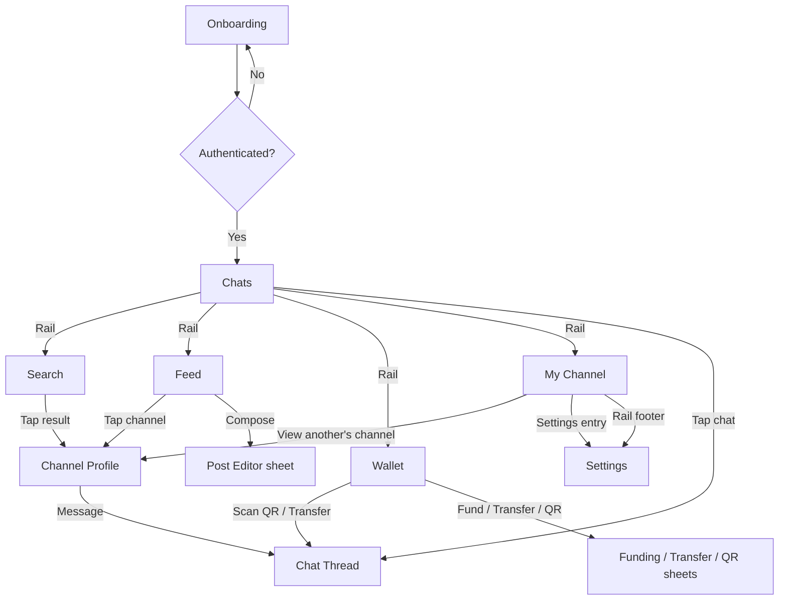

# Screens

## Screen Inventory

| # | Screen Name | File | Route / Path | Platform | Related Features |
|---|---|---|---|---|---|
| 1 | Onboarding | [[screens/01-onboarding\|Onboarding]] | `/onboarding` | Mobile | FEAT-001, FEAT-002, FEAT-004 |
| 2 | Chats | [[screens/02-chats\|Chats]] | `/chats` | Mobile | FEAT-003, FEAT-006 |
| 3 | Chat Thread | [[screens/03-chat-thread\|Chat Thread]] | `/chat/:id` | Mobile | FEAT-006, FEAT-007, FEAT-008, FEAT-009, FEAT-010, FEAT-013, FEAT-018 |
| 4 | Search | [[screens/04-search\|Search]] | `/search` | Mobile | FEAT-023, FEAT-024 |
| 5 | Feed | [[screens/05-feed\|Feed]] | `/feed` | Mobile | FEAT-026 |
| 6 | Wallet | [[screens/06-wallet\|Wallet]] | `/wallet` | Mobile | FEAT-010, FEAT-011, FEAT-012, FEAT-013, FEAT-014, FEAT-015 |
| 7 | My Channel | [[screens/07-my-channel\|My Channel]] | `/channel` | Mobile | FEAT-004, FEAT-005, FEAT-016, FEAT-017, FEAT-019, FEAT-020, FEAT-021, FEAT-022, FEAT-025, FEAT-027 |
| 8 | Channel Profile | [[screens/08-channel-profile\|Channel Profile]] | `/channel/:id` | Mobile | FEAT-005, FEAT-016, FEAT-023, FEAT-025, FEAT-026 |
| 9 | Settings | [[screens/09-settings\|Settings]] | `/settings` | Mobile | FEAT-003, FEAT-028, FEAT-029, FEAT-030, FEAT-031, FEAT-032 |

## Navigation Map

**Navigation model:** All authenticated screens live in the persistent frame — the **Side Rail** (Chats / Search / Feed / Wallet / Channel) plus the content area. Sheets and modals open over the content area only; the rail stays visible. Onboarding is the only screen outside the frame. See [[user_flow]] for the journeys and the Sheet & Modal Contract.

## Shared / Common Components

### Side Rail
Used on: Chats, Search, Feed, Wallet, My Channel (all in-frame screens)
- Persistent left rail, icon-first on narrow phones, expands to icon+label on wider screens
- Items: Chats, Search, Feed, Wallet, Channel — per [[branding]] Side Rail tokens (active = `primary-light` bg + 3px `primary` indicator bar)
- Unread dots on Chats; unread count badge on Chats when >9
- User avatar + Settings entry pinned at the rail's bottom

### AppBar (in-frame header)
Used on: all in-frame screens
- Title = current rail destination name
- Contextual actions right-aligned (e.g., Wallet: "Fund" primary button; Chats: "+" new chat)
- Subtle bottom border `border`; safe-area aware

### Sheet (modal bottom sheet)
Used on: Chat Thread, My Channel, Wallet, Feed
- Opens over content area, never over the rail
- Dismiss: swipe-down or X; parent context stays visible and preserved
- Rounded top corners `radius-lg`, elevation `shadow-lg`
- Scrolls internally; content never exceeds 80% of the frame height

### Modal (full overlay)
Used on: QR Scanner, Onboarding OTP, re-auth
- Dismiss: explicit Back/X; blocks interaction with content behind
- Used only when the task requires the user's full attention

### Empty State
Used on: Chats, Search, Feed, Wallet, My Channel (Shop/Orders tabs), Chat Thread (first message)
- Custom illustrated scene (200px) per the [[branding]] Visual Asset Direction — designer-created, not an icon
- Title: "No <items> yet" / contextual
- Subtitle: contextual hint
- CTA button when an action exists ("Add your first product", "Invite contacts", "Fund wallet")

### Error State
Used on: all screens with data fetching
- Centered illustration (200px)
- Title: "Something went wrong"
- Subtitle: brief error description
- Primary button: "Try Again" (retries); secondary "Go Back" where applicable

### Offline Banner
Used on: all in-frame screens
- Persistent banner under the AppBar: "You're offline — changes will sync when you're back"
- Non-blocking; disappears on reconnect

### Product Card
Used on: My Channel (Shop tab), Channel Profile (Shop tab)
- Square product photo (from merchant upload), name (2-line clamp), price in mono (`JetBrains Mono` per [[branding]])
- Stock state badge when out of stock
- Tap → Product detail sheet / add-to-order action

### Order Card
Used on: My Channel (Orders tab), Chat Thread
- Order ID, buyer/merchant name (graph contact), items summary, total in mono, status chip
- Status chip: color + label + icon (never color alone): New, Confirmed, Declined, Paid, Fulfilled, Delivered, Complete

### Payment Receipt Card
Used on: Chat Thread, Wallet (transaction history)
- Amount in mono, counterparty, timestamp, transaction ID (mono), status
- Share action → shareable receipt with transaction ID

### Post Card
Used on: Feed, Channel Profile (Posts tab)
- Author row (avatar, name, verified badge, timestamp), content (text and/or photo), action row (Like, Comment, Share to chat), comment count
- Comments visible only to mutual connections (server-enforced visibility)
- Tap author → `[[08-channel-profile|Channel Profile]]`

### Channel Header
Used on: Channel Profile, My Channel, Search results (channel rows)
- Avatar, name, verification badge (gold check), bio (clamped)
- Status line (FEAT-027) when set
- Action row: Message / Browse Shop / Follow (context-dependent)

### Verified Badge
Used on: Channel Header, Search results, chat headers
- Gold check glyph in `primary` on `surface-elevated`, `radius-full`
- Shown only for verified merchants (FEAT-005)

### Confirmation Dialog
Used on: destructive/critical actions (delete product, cancel order, leave group)
- Modal with title, body, "Cancel" (Ghost) + "Confirm" (Primary or Destructive)

### Amount Text
Used on: Wallet, Transfer sheet, Order cards, Receipts
- Always `JetBrains Mono`, `text-primary`; currency symbol per active locale
- Never clipped; uses font scaling tolerance