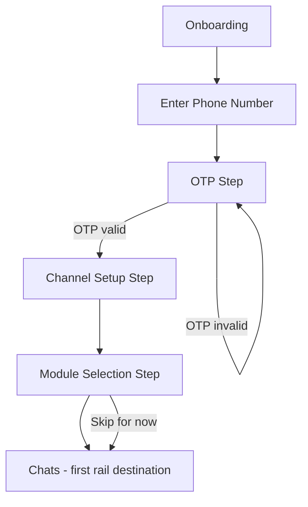
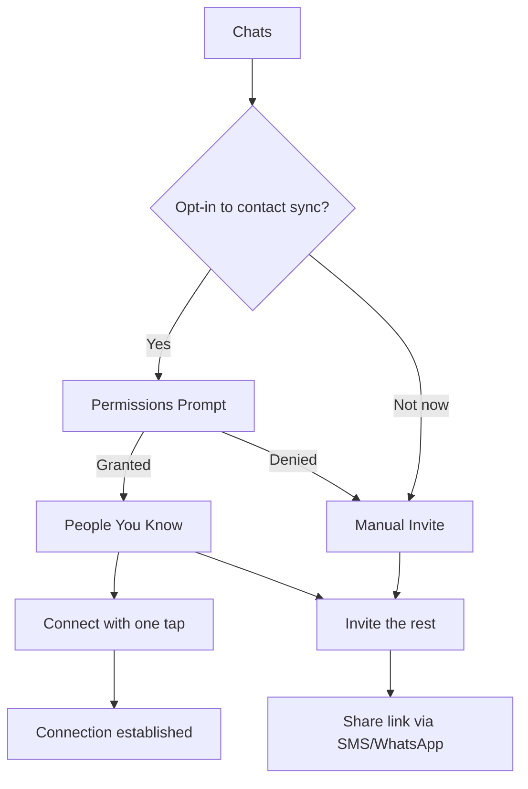
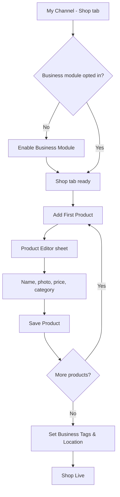
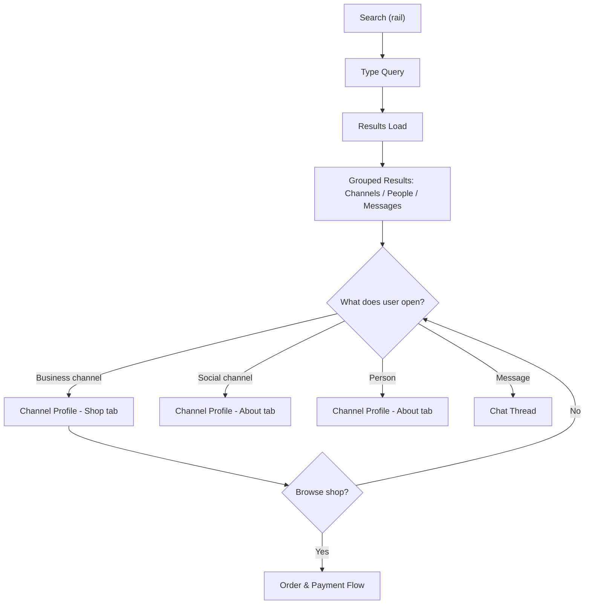
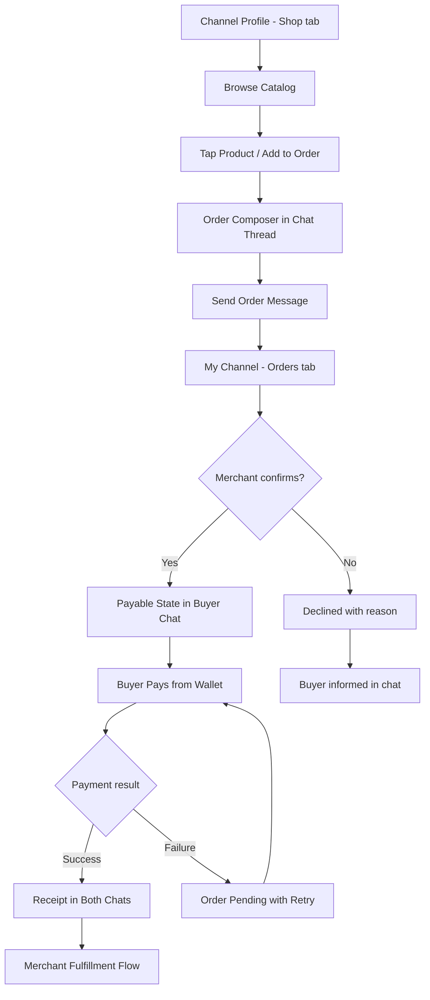
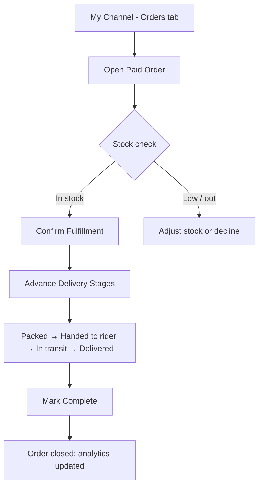
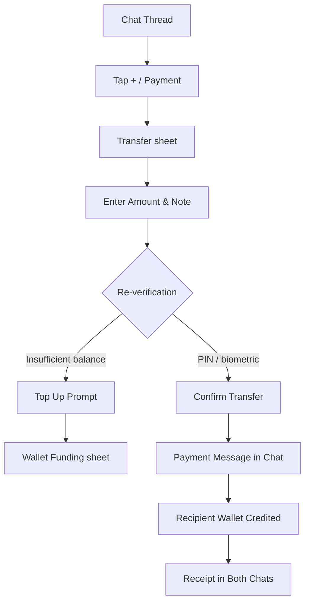
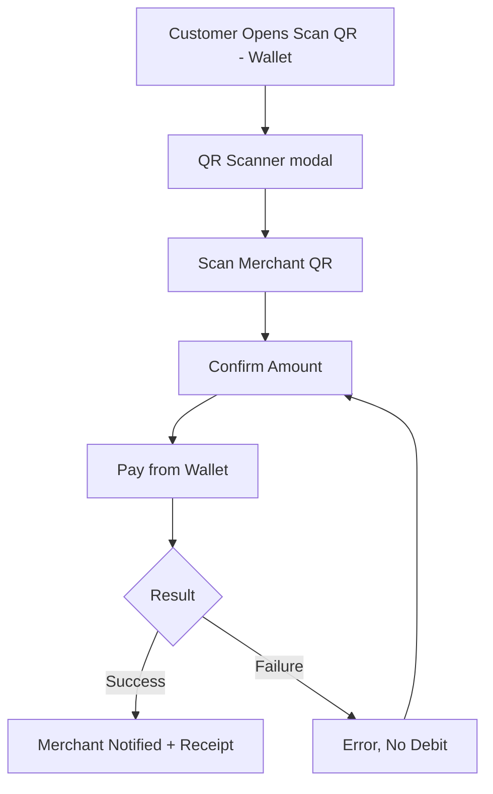
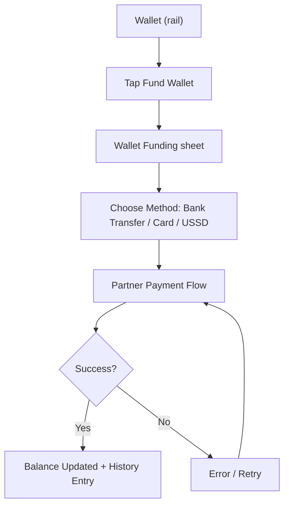
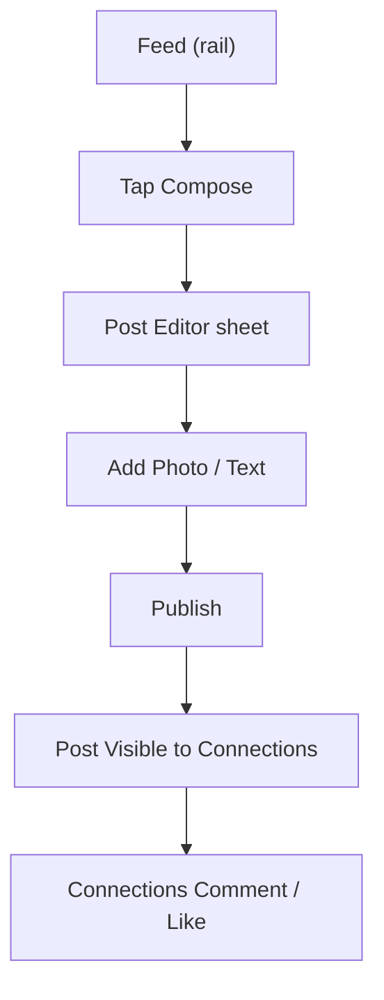

# User Flow

## Flow Inventory

| # | Flow Name | Persona | Entry Point | Outcome | Related Features |
|---|---|---|---|---|---|
| 1 | Onboarding & Channel Creation | New user (Ada, Chidi, Ngozi, Tunde) | App install | Account created, channel built, modules chosen | FEAT-001, FEAT-002, FEAT-004 |
| 2 | Connect & Invite Contacts | New / existing user | Chats or invite link | Contacts connected, invites sent | FEAT-003 |
| 3 | Merchant Shop Setup | Ada, Tunde | My Channel → Shop tab | Catalog live, tags set, shop findable | FEAT-004, FEAT-016, FEAT-019 |
| 4 | Unified Search & Discovery | Chidi, Ngozi | Search (rail) | Grouped results → channel/profile/message opened | FEAT-023, FEAT-024 |
| 5 | In-Chat Order & Payment | Chidi (buyer) + Ada (merchant) | Channel Profile → Shop tab | Order confirmed, paid, receipt in chat | FEAT-017, FEAT-018, FEAT-010 |
| 6 | Merchant Fulfillment & Delivery | Ada | My Channel → Orders tab | Order fulfilled, delivery tracked | FEAT-017, FEAT-020, FEAT-021 |
| 7 | P2P Transfer | Any user | Chat Thread | Money sent, both sides see it in chat | FEAT-010, FEAT-012 |
| 8 | QR Payment in the Market | Ada (merchant) + customer | Wallet (rail) | Customer pays, merchant notified | FEAT-011 |
| 9 | Wallet Funding | Any user | Wallet (rail) | Wallet balance increased, record in history | FEAT-010, FEAT-012 |
| 10 | Social Posting | Chidi, Tunde | Feed (rail) | Post published to connections | FEAT-026 |

**Navigation model:** all authenticated screens live in the persistent frame — a Discord-style **Side Rail** (Chats / Search / Feed / Wallet / Channel) plus the content area. Sheets and modals layer over the content area and never cover the rail, so the user always knows where they are. See [[screens]] for the component formalization.

## Flow 1: Onboarding & Channel Creation

**Persona:** New user (Ada, Chidi, Ngozi, Tunde)
**Entry Point:** App install
**Outcome:** Account created, channel built, modules chosen

### Diagram

### Walkthrough

**Happy Path:**
1. User opens the app and lands in Onboarding.
2. User enters their phone number; system sends an OTP.
3. User enters the OTP; system verifies and creates the account (terms/privacy accepted during signup per FEAT-001).
4. System presents the Channel Setup step: display name (required), bio, and avatar (optional).
5. User saves the channel; system makes name and bio immediately searchable (Layer 0 findability).
6. System presents Module Selection: Business, Social, both, or neither (messaging-only).
7. User picks their modules (or skips; messaging-only is fully usable per FEAT-004).
8. System lands the user on Chats, the first rail destination.

**Alternate Path A — OTP Failure:**
- At step 3, if the OTP is wrong or expired: system shows a clear error, offers "Resend code" with a countdown, and stays on the OTP step. After repeated failures, resend is throttled.

**Alternate Path B — Returning User:**
- At step 2, if the phone number is already registered: system recognizes it, skips Channel Setup and Module Selection, and goes straight to Chats.

**Alternate Path C — Channel Setup Skipped Midway:**
- If the user backs out of Channel Setup with only a name set: the channel is saved as name-only (minimum viable), and the user can complete bio/avatar later from My Channel.

**Alternate Path D — Offline During OTP:**
- OTP verification requires connectivity; the system shows an offline banner and blocks submission with a "You're offline" message. The user retries when connected.

### States Referenced
| Surface | States |
|---|---|
| Onboarding | Phone-step, OTP-step (sending/verifying/error/resend-throttled), Channel-step (saving/saved-minimal), Module-step (selected/skipped), Offline |

## Flow 2: Connect & Invite Contacts

**Persona:** New / existing user
**Entry Point:** Chats or invite link
**Outcome:** Contacts connected, invites sent

### Diagram

### Walkthrough

**Happy Path:**
1. User reaches Chats and is prompted to connect their phone contacts (or opens the contacts sheet from Chats).
2. User opts in; system requests contact permission.
3. System matches contacts already on Pamoja and shows "People You Know".
4. User taps Connect on each known contact; the connection is established when the other side accepts.
5. System offers to invite the remaining contacts via SMS/WhatsApp share link; the invite shows the inviter's channel.

**Alternate Path A — Permission Denied:**
- At step 2, if denied: the flow falls back to Manual Invite — the user can still share an invite link directly without contact access.

**Alternate Path B — Connection Request Pending:**
- At step 4, if the other party hasn't accepted: the contact shows a "Pending" state. The request stays until accepted, declined, or the sender cancels. No one becomes a connection unilaterally (FEAT-003).

**Alternate Path C — Blocked Contact:**
- If a matched contact has blocked the user: the contact does not appear in "People You Know" at all.

### States Referenced
| Surface | States |
|---|---|
| Chats (contacts sheet) | Permissions-prompt, Loading, People You Know, Pending, Empty, Offline |
| Invite sheet | Share-sheet, Sent |

## Flow 3: Merchant Shop Setup

**Persona:** Ada, Tunde
**Entry Point:** My Channel → Shop tab
**Outcome:** Catalog live, tags set, shop findable

### Diagram

### Walkthrough

**Happy Path:**
1. User opens My Channel and its Shop tab.
2. If the business module is not enabled, the user enables it (FEAT-004).
3. The Shop tab shows an empty state.
4. User taps "Add First Product"; the Product Editor opens as a sheet over the content area (the rail stays visible).
5. User fills name (required), photo (required), price (required), category, and optional description.
6. User saves; the product appears in the catalog and its name/category/description are indexed for search.
7. User repeats for their remaining products (up to the Free tier cap of 20, or unlimited on Merchant tier).
8. User sets business tags and location; tags and location become searchable immediately (FEAT-019).
9. The shop is live on the channel; visitors can browse it from their Channel Profile view.

**Alternate Path A — Missing Required Fields:**
- At step 6, if name/photo/price are missing: system highlights the fields with inline errors and blocks save until resolved.

**Alternate Path B — Photo Upload Fails / Offline:**
- If the device is offline or upload fails: the product draft is saved locally with a "pending upload" state; photo upload retries on reconnect. The user sees the draft clearly marked.

**Alternate Path C — Tier Cap Reached:**
- On the Free tier, if the user has 20 products and tries to add more: system shows an upgrade prompt to Merchant tier with a "View plans" action.

### States Referenced
| Surface | States |
|---|---|
| My Channel (Shop tab) | Empty, Loading, Loaded, Error, Offline |
| Product Editor sheet | Default, Saving, Validation-error, Offline-pending |
| Business tags (Shop tab section) | Default, Saving, Saved |

## Flow 4: Unified Search & Discovery

**Persona:** Chidi, Ngozi
**Entry Point:** Search (rail)
**Outcome:** Grouped results → channel/profile/message opened

### Diagram

### Walkthrough

**Happy Path:**
1. User taps Search in the rail.
2. User types "ankara" (or "running shoes", "tunde soles", "sneaker restoration").
3. System returns grouped results: channels (business and social), people, and messages, relevance-ranked.
4. Business channels surface via name, bio, tags, and catalog (Layer 0 + business module signals); social channels via name/bio.
5. User taps a business channel and lands on its Channel Profile, Shop tab.
6. From there the user can browse the shop (entering the Order & Payment flow) or message the merchant.

**Alternate Path A — Commerce Intent Query:**
- If the query reads as commerce intent ("I want to buy shoes"), system ranks business channels selling shoes above social/people results.

**Alternate Path B — No Results:**
- If nothing matches: system shows an empty state with a corrected-query suggestion (e.g., "Did you mean 'ankara'?" or "Try a broader word like 'fashion'").

**Alternate Path C — Product-Level Match:**
- On FEAT-024, product-level matches appear with filters (category, location, verified-only, price). Tapping a product leads to the merchant's catalog scrolled to that product (Channel Profile → Shop tab).

**Alternate Path D — Offline:**
- Search requires connectivity; offline shows a banner and the last cached results with a "results may be stale" note.

### States Referenced
| Surface | States |
|---|---|
| Search (rail) | Default, Typing, Loading, Loaded, No-results, Offline |
| Search results (content area) | Loading, Loaded (grouped), Empty, Error |
| Channel Profile | Loading, Loaded (About/Shop/Posts), Error |

## Flow 5: In-Chat Order & Payment

**Persona:** Chidi (buyer) + Ada (merchant)
**Entry Point:** Channel Profile → Shop tab
**Outcome:** Order confirmed, paid, receipt in chat

### Diagram

### Walkthrough

**Happy Path:**
1. Buyer opens the merchant's Channel Profile and browses the Shop tab.
2. Buyer selects products and quantities; system opens an Order Composer inside a Chat Thread with the merchant.
3. Buyer sends the order as a chat message; system shows it as an order card with items, quantities, and total.
4. Merchant sees the order in My Channel → Orders tab with buyer identity (a graph contact, not an anonymous row).
5. Merchant confirms the order; system switches the buyer's order card to a payable state.
6. Buyer taps Pay; payment is taken from the wallet (with re-verification per app lock settings).
7. On success, both sides receive a receipt message in the same thread; the merchant's order shows paid.
8. Flow continues to Merchant Fulfillment (Flow 6).

**Alternate Path A — Merchant Declines:**
- At step 5, if the merchant declines: system shows the reason in the buyer's chat and the order closes. No payment is attempted.

**Alternate Path B — Payment Failure:**
- At step 7, if payment fails (insufficient balance, partner downtime): the order stays pending with a Retry action in the chat. The buyer's balance is unchanged (idempotent — no double debit per [[architecture]]).

**Alternate Path C — Buyer Cancels Before Payment:**
- The buyer can cancel a confirmed-but-unpaid order from the chat; the merchant sees the cancellation.

**Alternate Path D — Offline:**
- Order messages queue offline and replay on reconnect. Payment itself requires connectivity; the pay button shows "You're offline" if disconnected.

### States Referenced
| Surface | States |
|---|---|
| Chat Thread | Default, Order-card, Payable, Paid, Receipt, Pending-payment, Offline |
| My Channel (Orders tab) | New, Confirmed, Declined, Paid, Fulfilled |
| Order Composer (in chat) | Selecting, Sending, Sent |

## Flow 6: Merchant Fulfillment & Delivery

**Persona:** Ada
**Entry Point:** My Channel → Orders tab
**Outcome:** Order fulfilled, delivery tracked

### Diagram

### Walkthrough

**Happy Path:**
1. Merchant opens My Channel → Orders tab and sees a paid order (New state).
2. Merchant opens the order detail sheet: buyer, items, quantity, amount, delivery address.
3. Merchant checks stock; system auto-decrements stock on confirmation (FEAT-020).
4. Merchant confirms fulfillment; the buyer sees the status in chat.
5. Merchant advances delivery stages: packed → handed to rider → in transit → delivered.
6. Both parties see each stage; stage changes trigger notifications.
7. Merchant (or buyer) marks the order complete; analytics update with the sale.

**Alternate Path A — Insufficient Stock:**
- At step 3, if stock can't cover the order: merchant adjusts stock or declines with a reason; the buyer is informed and refunded if already paid.

**Alternate Path B — Free Tier (no delivery tracking):**
- On the Free tier, FEAT-021 is absent: the merchant can only confirm fulfillment; the buyer sees "confirmed" and the merchant completes the order manually.

### States Referenced
| Surface | States |
|---|---|
| My Channel (Orders tab) | New, Confirmed, Declined, Paid, Fulfilled, Delivered |
| Order detail sheet | Loading, Loaded, Delivery-stages, Complete |

## Flow 7: P2P Transfer

**Persona:** Any user
**Entry Point:** Chat Thread
**Outcome:** Money sent, both sides see it in chat

### Diagram

### Walkthrough

**Happy Path:**
1. User opens a Chat Thread with a connection.
2. User taps the + / Payment button and selects "Send money".
3. Transfer sheet opens pre-filled with the recipient; user enters amount and an optional note.
4. User confirms; system requests re-verification (PIN/biometric if app lock requires it for wallet actions).
5. System debits the sender's wallet, credits the recipient, and posts a payment message in the chat.
6. Both parties see the receipt in the thread; the transaction appears in both histories.

**Alternate Path A — Insufficient Balance:**
- At step 4, if the balance is short: system shows a Top Up prompt leading to the Wallet Funding sheet (Flow 9). No transfer is attempted.

**Alternate Path B — Partner Downtime:**
- If the payment partner is down: the transfer fails atomically, the sender's balance is unchanged, and a clear error with Retry appears. No queued transfer is silently dropped.

**Alternate Path C — Sending to a Non-Connection:**
- P2P transfers require a connection (graph contact). Sending to someone outside the graph requires connecting first.

### States Referenced
| Surface | States |
|---|---|
| Transfer sheet | Default, Verifying, Processing, Success, Error, Insufficient-balance |
| Chat Thread | Payment-message, Receipt |

## Flow 8: QR Payment in the Market

**Persona:** Ada (merchant) + customer
**Entry Point:** Wallet (rail)
**Outcome:** Customer pays, merchant notified

### Diagram

### Walkthrough

**Happy Path:**
1. Customer taps Scan QR from the Wallet rail destination.
2. The QR Scanner opens as a modal; the customer scans the merchant's static payment QR (displayed from the merchant's channel or business module).
3. System shows the merchant identity (a known contact where applicable) and the amount (pre-set or editable for open amounts).
4. Customer confirms and pays from the wallet.
5. Merchant receives a real-time payment notification identifying the payer; both sides get a receipt.
6. The transaction appears in both histories.

**Alternate Path A — Unknown Merchant:**
- If the QR belongs to an unverified or non-contact channel: system shows the merchant's channel identity and verification status before payment, so the customer can decide.

**Alternate Path B — Payment Failure:**
- On failure, the merchant sees no credit and the customer sees no debit; the customer can retry.

**Alternate Path C — Low Light / Damaged QR:**
- If the QR can't be scanned: the merchant can share the payment link from the channel instead.

### States Referenced
| Surface | States |
|---|---|
| QR Scanner modal | Camera, Detecting, Confirming, Processing, Success, Error |
| Payment notification | Received |

## Flow 9: Wallet Funding

**Persona:** Any user
**Entry Point:** Wallet (rail)
**Outcome:** Wallet balance increased, record in history

### Diagram

### Walkthrough

**Happy Path:**
1. User opens Wallet and taps Fund Wallet.
2. The Wallet Funding sheet opens; the user chooses a method available in their market (bank transfer, card, or USSD via the licensed partner).
3. System hands off to the partner's payment flow (Pamoja never stores card/bank credentials).
4. On confirmation, the wallet balance updates and the transaction appears in history.

**Alternate Path A — Partner Handoff:**
- The user may be taken to a partner-hosted screen; on return, Pamoja reconciles the balance from the partner callback.

**Alternate Path B — Pending Bank Transfer:**
- Bank transfers may take time: the system shows the funding as pending in history until the partner confirms.

### States Referenced
| Surface | States |
|---|---|
| Wallet (rail) | Default, Funding-method, Pending, Updated, Error |
| Wallet Funding sheet | Method-select, Partner-handoff, Pending, Error |
| Transaction history (Wallet section) | Loading, Loaded, Pending-entry |

## Flow 10: Social Posting

**Persona:** Chidi, Tunde
**Entry Point:** Feed (rail)
**Outcome:** Post published to connections

### Diagram

### Walkthrough

**Happy Path:**
1. User opens the Feed and taps Compose.
2. Post Editor opens as a sheet; user adds a photo, text, or both.
3. User publishes; the post is visible only to their connections (FEAT-026).
4. Connections see the post in their feed; comments are visible only to mutual connections.

**Alternate Path A — Offline:**
- The post queues locally and publishes on reconnect, showing a pending state until then.

**Alternate Path B — Delete:**
- The user can delete a post anytime; deletion propagates to all viewers.

### States Referenced
| Surface | States |
|---|---|
| Feed (rail) | Loading, Empty, Loaded, Error, Offline |
| Post Editor sheet | Default, Publishing, Pending, Published |

## Global Flows

### Authentication Gate
- Any screen accessed via deep link while unauthenticated → redirect to Onboarding.
- After successful OTP → redirect back to the originally requested destination.
- Session expired while on a screen → show re-authentication modal (re-verify OTP), do not lose current screen state.
- Wallet actions always re-verify (PIN/biometric) when app lock is enabled, per FEAT-028.

### Error Recovery
- Any API call fails with 5xx → show inline error with Retry; preserve the user's input.
- Any API call fails with 401 → trigger re-authentication flow.
- Any API call fails with 403 → show "You don't have permission" state.
- Network lost during data entry → queue the action, show offline banner, sync on reconnect.
- Payment failures → idempotent retry; never re-debit on retry (per [[architecture]]).
- App lock escalation → after repeated failed unlock attempts, delay then force re-login.

### Cross-Border / Multi-Currency Gate (FEAT-014/015 readiness)
- If a user attempts an action in an unsupported currency or corridor → clear "not yet available" state with an explanation, never a failed attempt (per [[features]] FEAT-014).
- Corridor transfers show total cost (fee + spread) before confirmation (FEAT-015).

### Sheet & Modal Contract (the smart-UI rule)
- Every sheet/modal opens over the content area and **never covers the Side Rail**, so the user always knows where they are.
- Every sheet/modal has an obvious exit: swipe-down or X for sheets, back for modals. Nothing opens a surface the user can't immediately see how to leave.
- Sheets keep their parent context visible behind them — closing a sheet returns to exactly where the user was, with state preserved.